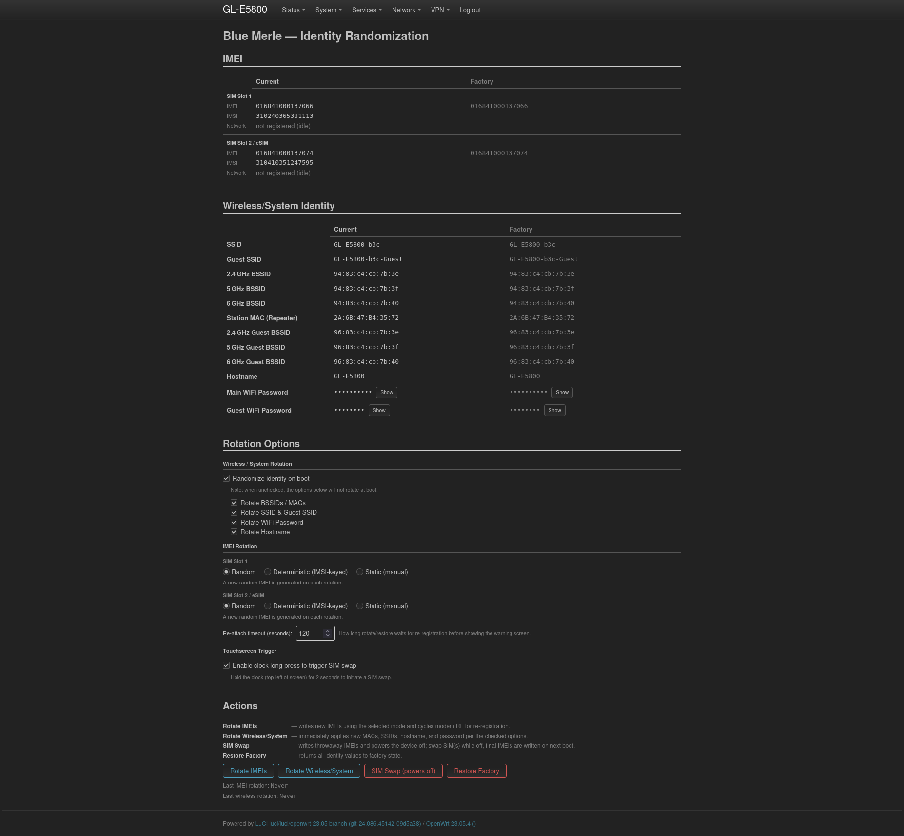
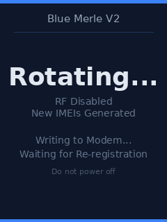
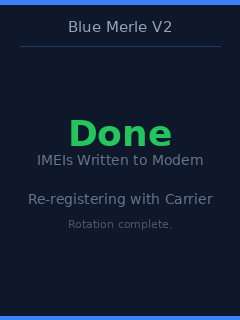
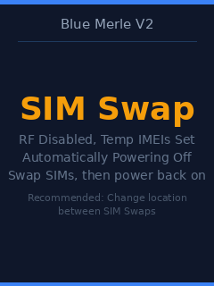
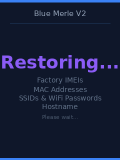
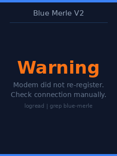
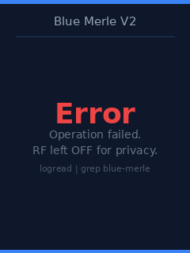

# Blue Merle v2

[](https://github.com/WSchlesner/blue-merle-v2/actions/workflows/build.yml)
[](https://github.com/WSchlesner/blue-merle-v2/actions/workflows/sdk-build.yml)
[](#license)
[-orange.svg)](#compatibility)

**Anonymity enhancements for the GL-iNet GL-E5800 (Mudi 7) 5G mobile hotspot** — dual-slot IMEI rotation, MAC/BSSID/SSID/hostname/password randomization, a two-stage SIM-swap flow, and volatile client-MAC storage, controlled from the command line, a LuCI admin page, or the device's touchscreen.

A ground-up rewrite of [SRLabs' blue-merle](https://github.com/srlabs/blue-merle) for the Mudi 7. The original targeted the GL-E750 Mudi; the Mudi 7 ships with a completely different modem (Quectel RG650V-NA, integrated MHI instead of USB), a rewritten `gl_modem` wrapper, dual SIM + eSIM support, a touchscreen instead of a hardware switch, and a new UCI layout — so nothing of v1 survived unchanged.

> **Legal note:** changing your device's IMEI is restricted or unlawful in some jurisdictions. This software is provided for lawful privacy research and personal use where permitted. You are responsible for compliance with your local laws.

<!-- ──────────────────────────────────────────────────────────────────────────
     MEDIA CAPTURE CHECKLIST — drop files into assets/ with these exact names,
     then delete each placeholder comment where the file is referenced below:

       assets/screenshots/luci-admin-page.png      ✅ captured
       assets/screenshots/gl-about-device.png      — GL-iNet UI: Settings → About Device showing a rotated IMEI
       assets/screenshots/device-rotating.jpg      — Mudi 7 screen: blue "Rotating..." splash
       assets/screenshots/device-done.jpg          — Mudi 7 screen: green "Done" splash
       assets/screenshots/device-simswap.jpg       — Mudi 7 screen: amber "SIM Swap" splash
       assets/screenshots/device-warning.jpg       — Mudi 7 screen: orange "Warning" splash
       assets/videos/touchscreen-trigger.gif       — 2 s clock long-press triggering a SIM swap (GIF embeds inline on GitHub)
       assets/videos/sim-swap-flow.mp4             — optional: full two-stage SIM-swap walkthrough (link, not embedded)
     ────────────────────────────────────────────────────────────────────── -->

---

## Table of Contents

- [Features](#features)
- [Compatibility](#compatibility)
- [Quick Start](#quick-start)
- [Usage](#usage)
  - [LuCI admin page](#luci-admin-page)
  - [Command line](#command-line)
  - [Touchscreen trigger](#touchscreen-trigger)
  - [Health check](#health-check)
- [How It Works](#how-it-works)
  - [What it protects (and what it can't)](#what-it-protects-and-what-it-cant)
  - [Boot sequence](#boot-sequence)
  - [IMEI rotation](#imei-rotation)
  - [IMEI modes](#imei-modes)
  - [SIM-swap flow](#sim-swap-flow)
  - [MAC, BSSID, and SSID randomization](#mac-bssid-and-ssid-randomization)
  - [Volatile client MACs](#volatile-client-macs)
  - [Splash screens](#splash-screens)
- [Configuration Reference](#configuration-reference)
- [Building from Source](#building-from-source)
- [Uninstalling](#uninstalling)
- [AT Commands We Deliberately Avoid](#at-commands-we-deliberately-avoid)
- [Project Status](#project-status)
- [Repository Layout](#repository-layout)
- [Acknowledgements](#acknowledgements)
- [License](#license)

---

## Features

| Feature | Description |
|---|---|
| **Dual IMEI rotation** | Both modem IMEI slots (SIM 1 + SIM 2/eSIM) rotated independently via `AT+EGMR`, persisted to modem NV |
| **Three IMEI modes** | Per-slot: **Random** (Luhn-valid, band-matched TAC), **Deterministic** (stable hash of the SIM's IMSI), or **Static** (user-supplied) |
| **Consistent wireless identity** | One router vendor per rotation: all BSSIDs share a single OUI and the SSID broadcasts a matching brand name — no impossible vendor mixes |
| **Wireless rotation** | BSSIDs/MACs, SSID, hostname, and Wi-Fi passwords randomized on demand or on every boot |
| **Two-stage SIM swap** | Throwaway IMEIs written before poweroff; final IMEIs written on next boot *before* the modem first attaches — neither real identity bridges the swap |
| **Volatile client MACs** | `tmpfs` mounted over GL-iNet's client-MAC database — connected-device history never reaches flash |
| **Network visibility** | Per-slot registration state, operator, and signal in both the CLI and LuCI |
| **Health check** | `blue-merle check` — 16-point read-only self-test of the modem, generator, frames, and services |
| **Three control surfaces** | CLI over SSH, LuCI admin page, and a 2-second touchscreen long-press for SIM swap |
| **GL-iNet UI sync** | Settings → About Device shows the new IMEI automatically after every rotation |
| **Splash screens** | Six full-screen status frames written straight to the framebuffer during operations |

---

## Compatibility

| | |
|---|---|
| **Device** | GL-iNet GL-E5800 (Mudi 7) |
| **Firmware** | GL.iNet 4.8.3 (OpenWrt 23.05.4) and 4.8.5 |
| **Modem firmware** | `RG650VNA01ACR02A04G8G` (unchanged between 4.8.3 and 4.8.5) |
| **Architecture** | `aarch64_cortex-a53` |
| **Dependencies** | `luci-base`, `lua`, `luabitop` — all present in stock firmware |

The installer verifies the device model and firmware version before touching anything. Unknown firmware versions prompt for confirmation (interactive SSH installs only; non-interactive installs on unknown firmware abort safely).

> **Firmware upgrades remove the package without running its uninstall hooks.** Factory state survives in `/etc/config/blue-merle`, but the modem keeps its rotated IMEIs and GL-iNet's own BSSID randomization stays disabled until you reinstall blue-merle (or restore manually). Reinstall after every firmware upgrade.

---

## Quick Start

**1. Enable LuCI** (bundled with the firmware, off by default — no internet required):

1. Open the GL-iNet web UI at `http://192.168.8.1`
2. Go to **System → Advanced Settings**
3. Click **Install Now** — this just starts the `uhttpd` web server
4. LuCI is now at `http://192.168.8.1:8080`

**2. Install the package:**

```sh
scp -O blue-merle-v2-1.0.0-local.ipk root@192.168.8.1:/tmp/
ssh root@192.168.8.1 opkg install /tmp/blue-merle-v2-1.0.0-local.ipk
```

Expected output:

```
Installing blue-merle-v2 (1.0.0) to root...
Firmware 4.8.5 confirmed supported.
Configuring blue-merle-v2.
blue-merle: capturing factory state...
  IMEI (slot 1):   352000067890125
  IMEI (slot 2):   352000067890133
  WiFi MAC (2.4g): a8:22:42:1a:2b:3c
  SSID:            GL-E5800-1a2b
  Hostname:        GL-E5800
  WiFi keys saved: main + guest
blue-merle: factory state saved to /etc/config/blue-merle
blue-merle: installation complete. Rotate identity via: blue-merle rotate
```

The original device identity is captured **once** at install time and is never overwritten — reinstalls and upgrades (`opkg install --force-reinstall`) preserve it.

**3. Verify and rotate:**

```sh
ssh root@192.168.8.1
blue-merle check     # everything should PASS
blue-merle rotate    # first identity rotation
```

The admin page is under **Services → Blue Merle** in LuCI.

---

## Usage

### LuCI admin page

**Services → Blue Merle** (`http://192.168.8.1:8080`):



| Section | Contents |
|---|---|
| **IMEI** | Current vs. factory IMEI per slot, IMSI, and live network state (registration / operator / signal — loaded asynchronously). Rotated values are highlighted green. |
| **Wireless/System Identity** | Current vs. factory SSID, all nine MACs/BSSIDs, hostname, and the main/guest Wi-Fi passwords (masked, with Show/Hide). |
| **Rotation Options** | Boot-rotation master toggle + per-feature checkboxes; per-slot IMEI mode radios (Random / Deterministic / Static) with inline-validated static IMEI fields; re-attach timeout; touchscreen trigger toggle. Every control saves instantly with a ✓ flash. |
| **Actions** | Rotate IMEIs, Rotate Wireless/System, SIM Swap (double-confirmed — powers the device off), Restore Factory. Last-rotation timestamps below. |
| **Last Command Log** | Output of the most recent operation (`/tmp/blue-merle.log`). |

### Command line

```sh
blue-merle status            # identity + network registration overview
blue-merle check             # health check (see below)
blue-merle rotate            # rotate both IMEIs, cycle RF, wait for re-attach
blue-merle rotate-wireless   # rotate MACs/SSID/hostname/password immediately
blue-merle sim-swap          # stage 1 of the SIM-swap flow (powers off!)
blue-merle restore           # restore every factory value
blue-merle install           # (re-)capture factory state — idempotent
blue-merle help              # full usage, including per-slot mode flags
```

Per-slot IMEI modes can be set for a single run (`--slot1=deterministic --slot2=random`, or `--random`/`--deterministic`/`--static` for both) — invalid modes and unknown options fail loudly rather than silently falling back. Persistent mode defaults live in UCI (see [Configuration Reference](#configuration-reference)).

Example `rotate`:

```
blue-merle: disabling RF before IMEI write...
blue-merle: generating IMEIs (slot1=random, slot2=random)...
  Slot 1 IMEI: 354491081234567
  Slot 2 IMEI: 860371059876543
  Slot 1 IMEI confirmed: 354491081234567
  Slot 2 IMEI confirmed: 860371059876543
blue-merle: cycling modem RF for network re-attach...
blue-merle: done.
```

`status` includes a Network section — the first place to look when a SIM won't connect:

```
=== Network ===
  Slot 1 registration: registered (home)
  Slot 2 registration: not registered (idle)
  Operator: T-Mobile
  Signal:   -77 dBm
```

<!-- PLACEHOLDER: assets/screenshots/gl-about-device.png — GL-iNet UI Settings → About Device
     showing the rotated IMEI, captioned "GL-iNet's own UI reflects the rotated IMEI automatically." -->

### Touchscreen trigger

Hold the **clock in the top-left corner** of the home screen for **2 seconds** to start a SIM swap — identical to running `blue-merle sim-swap` over SSH, no laptop needed.

The `blue-merle-touch` daemon (a 350 KB statically linked C binary, source in `src/`) reads `/dev/input/event0` without grabbing it, so the stock `gl_screen` UI keeps working normally. Guards against accidental triggers:

- 2-second hold required — quick taps are logged and ignored
- 10-second cooldown between triggers
- Blocked while a sim-swap is already in progress (stage file present)

Toggle it (persists across reboots and reinstalls) from LuCI → Rotation Options → **Touchscreen Trigger**, or over SSH: `/etc/init.d/blue-merle-touch disable && /etc/init.d/blue-merle-touch stop`.

<!-- PLACEHOLDER: assets/videos/touchscreen-trigger.gif — short GIF of the 2 s clock long-press
     and the SIM Swap splash appearing. GIFs embed inline on GitHub; an .mp4 can be linked too. -->

### Health check

`blue-merle check` is a read-only self-test — run it any time something seems off, or after a firmware update:

```
=== blue-merle health check ===

Modem:
  PASS  gl_modem present
  PASS  AT socket present (/tmp/modem.CPU.AT.sock)
  PASS  modem answers AT commands
  PASS  IMEI readable (slot 1: 016841000137066)

IMEI generator:
  PASS  lua generator produces valid IMEIs (sample: 356767107342622)
  PASS  TAC pool present (7 TACs)
  PASS  OUI pool present (20 router identities)

Splash frames:
  PASS  all 6 frames present
  PASS  framebuffer present (/dev/fb0)

Services:
  PASS  blue-merle-volatile-macs enabled
  PASS  blue-merle-wireless enabled
  PASS  blue-merle-sim-swap enabled
  PASS  blue-merle-touch enabled and running
  PASS  client-MAC database is RAM-backed (tmpfs mounted)

State:
  PASS  factory state saved

Result: all checks passed.
```

Exit code is non-zero if anything FAILs, so it can be scripted.

---

## How It Works

### What it protects (and what it can't)

Blue Merle reduces the **device-identity** trail a mobile hotspot leaves behind: the IMEI broadcast to cell towers, the Wi-Fi MACs/BSSIDs/SSID visible to anyone scanning nearby, the hostname, and the on-flash history of clients that connected. It cannot anonymize what it doesn't control:

- **The SIM is an identity.** The IMSI/ICCID identify the subscriber regardless of IMEI. Rotating the IMEI without swapping the SIM only unlinks the *hardware*; use the SIM-swap flow (new SIM + new IMEI + new location, together) for a clean break.
- **Location and usage patterns correlate.** Re-appearing in the same place, at the same times, with the same traffic patterns can re-link identities no rotation can hide.
- **Upstream traffic is out of scope.** Use a VPN/Tor on top; blue-merle handles the radio identity layer only.

The deterministic IMEI mode trades unlinkability for consistency — see [IMEI modes](#imei-modes).

### Boot sequence

| Priority | Service | What it does |
|---|---|---|
| S9 | `blue-merle-volatile-macs` | Mounts `tmpfs` over `/etc/oui-tertf/` before GL-iNet's client tracker starts — the client-MAC database lives in RAM and evaporates at every reboot. |
| S10 | `blue-merle-wireless` | If boot rotation is enabled: rotates MACs, SSID, hostname, and Wi-Fi passwords *before* the APs come up. |
| S23 | `gl_cellular_manager` | GL-iNet's modem init daemon — the first point in boot where the AT socket accepts commands. |
| S25 | `blue-merle-sim-swap` | Only when a sim-swap is pending: waits for the AT socket, disables RF, writes the final IMEIs, re-enables RF. The throwaway IMEI from Stage 1 is replaced before the modem ever attaches. Exits instantly on normal boots. |
| S80 | `gl_screen` | GL-iNet's touchscreen UI daemon. |
| S81 | `blue-merle-touch` | The long-press trigger daemon (procd-managed, auto-respawns). |

### IMEI rotation

1. RF off (`AT+CFUN=4`) — the old IMEI stops transmitting before anything is written
2. Both slots written via `AT+EGMR` (field 7 = Slot 1, field 11 = Slot 2/eSIM), NV-persisted with `AT+QPRTPARA=1`
3. RF on (`AT+CFUN=1`) + automatic operator re-attach (`AT+COPS=0`)
4. Registration polled via `AT+CEREG?` until attached or the configured timeout (default 120 s)
5. `gl_cellular_manager` restarted so GL-iNet's cached IMEI (Settings → About Device) matches the modem

A re-attach timeout is **non-fatal**: the warning screen is shown, RF stays on, and the modem keeps retrying in the background — relevant for factory-fresh SIMs whose first activation can take the carrier several minutes.

If a *write* fails, blue-merle deliberately leaves RF **off** rather than transmitting a half-rotated identity, shows the error screen, and prints recovery steps (re-run, `blue-merle restore`, or `gl_modem -B CPU -U 1 AT 'AT+CFUN=1'` to force RF back on).

### IMEI modes

**Random** (default) — a TAC from `tac_pool.json` + 6 random serial digits + Luhn check digit. The pool is curated to 5G sub-6 hotspots/handsets whose band sets overlap the RG650V-NA's (n2/n5/n12/n25/n41/n66/n70/n71/n77/n78). This matters: carriers can compare a reported IMEI's expected capabilities against the cell it connects on, and a 4G-only TAC on a 5G NR cell is a contradiction — confirmed on real hardware to trigger ~10 Mbps throttling on at least one US carrier. Don't add LTE-only TACs to the pool.

**Deterministic** — `IMEI = luhn(tac_pool[djb2(IMSI) % n] + serial(djb2(IMSI)))`. The same SIM always maps to the same IMEI, useful when a carrier flags frequent IMEI changes on one subscription. **Privacy trade-off:** djb2 is a public, unkeyed hash — anyone who once observes the IMEI+IMSI pairing can re-derive the link forever. Random is strictly better for unlinkability.

**Static** — a user-supplied 15-digit IMEI, Luhn-validated in the LuCI form *and* server-side. Written verbatim on every rotation.

All three fall back to Random (with a warning) if their inputs are unavailable, so a rotation never fails because of a missing IMSI or an unset static value.

### SIM-swap flow

The problem with a naive swap: if the modem ever holds *old SIM + new IMEI* (or vice versa), the two identities become linkable. Blue Merle splits the swap across a power cycle so they never coexist on air:

1. **Stage 1** (`blue-merle sim-swap`, touchscreen, or LuCI): RF off → random **throwaway** IMEIs written to both slots → state saved → device powers off
2. You swap SIM(s) — and ideally location — while it's off
3. **Stage 2** (S25, automatic on next boot): final IMEIs (per your configured modes) are written *before* the modem's first attach; the throwaway IMEIs never register

If Stage 2 can't reach the modem it leaves the pending state in place and retries next boot — the modem keeps the harmless throwaway identity in the meantime.

<!-- PLACEHOLDER: assets/videos/sim-swap-flow.mp4 — optional full walkthrough:
     trigger → poweroff → SIM swap → boot → Stage 2 splash → new identity in LuCI. Link it here. -->

### MAC, BSSID, and SSID randomization

Every rotation picks **one router identity** — a single vendor OUI plus its SSID brand — from the curated pool in `oui_pool.json`:

- All six AP interfaces (`wifi2g/5g/6g` + guests) get that one OUI with random NIC bytes, like a real consumer router. Mixing vendors across bands is a fingerprinting flag no real device exhibits.
- The SSID becomes `<brand>-XXXX` to match (e.g., a Netgear OUI broadcasts `NETGEAR-A3F1`). Vendors whose factory SSIDs aren't brand-prefixed (Google Nest, Meraki) use a generic `HOME-XXXX`, plausible with any OUI.
- The **STA (repeater) interface** gets a *client*-class OUI (Apple/Intel/Samsung laptops and phones) — upstream networks see a client device, not a router.
- The **locally-administered bit** is forced on every generated MAC: the Qualcomm `ath11k` driver requires LA MACs for runtime channel changes on AP interfaces (GL-iNet's channel co-location in repeater mode breaks with UA MACs).

GL-iNet's own `random_bssid` feature is disabled at install (it generates UA MACs on its own schedule) and re-enabled at uninstall. Hostname becomes `router-XXXX`; main and guest networks get independent random 12-hex-character passwords.

### Volatile client MACs

GL-iNet's `gl_clients` daemon keeps a persistent database of every client MAC that ever connected, at `/etc/oui-tertf/client.db` on flash. At S9 blue-merle deletes the on-flash copy and mounts a `tmpfs` over the directory — the daemon keeps writing without knowing it's writing to RAM, and the history starts empty every boot.

(The old file is unlinked, not overwritten: the Mudi 7's overlay is ext4 on eMMC, whose flash translation layer remaps writes — overwrite-in-place tools like `shred` are ineffective there. The tmpfs mount is the real protection.)

### Splash screens

During operations, blue-merle stops `gl_screen` and writes pre-rendered frames (240×320 RGB565) directly to `/dev/fb0`:

| | | |
|:---:|:---:|:---:|
|  |  |  |
|  |  |  |

| Frame | Shown when |
|---|---|
| `rotating` | IMEI rotation or sim-swap Stage 2 in progress |
| `done` | Operation complete and modem re-registered |
| `simswap` | Stage 1: powering off for the SIM swap |
| `restoring` | Factory restore in progress |
| `warning` | Soft failure: IMEIs written but no re-registration within the timeout (modem keeps retrying) |
| `error` | Hard failure: a write failed; **RF is left off** until recovered |

<!-- PLACEHOLDERS: photos of the real device showing the splash frames —
     assets/screenshots/device-rotating.jpg, device-done.jpg, device-simswap.jpg, device-warning.jpg
     (a 2×2 photo grid will replace the PNG previews above once captured) -->

Frames are generated by `screens/generate.py` (Python 3 + Pillow, dev-side only — the device never needs Python) and committed as binaries. To modify: edit the `FRAMES` list, run `python3 generate.py`, commit the regenerated `.rgb565` files and PNG previews.

Implementation note: `gl_screen` respawns via procd, so a plain `stop` would repaint over our frame within seconds — `_screen_splash` first removes it from procd's watch list (`ubus call service delete`), then stops it, then writes the frame. A separate GL-iNet boot process draws a progress bar at a fixed screen position during early boot; the `rotating`/`done` layouts leave that row empty so Stage 2 splashes aren't overdrawn.

---

## Configuration Reference

Everything lives in `/etc/config/blue-merle` (standard UCI). The `factory` section is written once at install; the `options` section is yours:

```
config blue-merle 'options'
    option randomize_on_boot    '1'        # rotate wireless identity at every boot
    option randomize_mac        '1'        # per-feature toggles for boot + rotate-wireless
    option randomize_ssid       '1'
    option randomize_hostname   '1'
    option randomize_password   '1'
    option imei_mode_slot1      'random'   # random | deterministic | static
    option imei_mode_slot2      'random'
    option static_imei_slot1    ''         # used when the slot's mode is 'static'
    option static_imei_slot2    ''
    option register_timeout     '120'      # seconds to wait for re-attach (10-600)
    option touch_enabled        '1'        # touchscreen trigger preference
```

All values are editable from the LuCI page (changes apply instantly) or via `uci set blue-merle.options.<name>=<value> && uci commit blue-merle`. Every value is validated server-side — malformed input is rejected, never written to the modem.

---

## Building from Source

Three paths, depending on your workflow:

### 1. `build-ipk.sh` — no SDK required

```sh
git clone https://github.com/WSchlesner/blue-merle-v2.git
cd blue-merle-v2
./build-ipk.sh
```

Needs only `bash`, `tar`, and `gzip`. Produces `blue-merle-v2-1.0.0-local.ipk` from the `files/` tree, bundling the pre-compiled `blue-merle-touch` binary. **Use for:** day-to-day development and offline builds.

### 2. OpenWrt SDK — `Makefile`

A standard OpenWrt package recipe that compiles `src/blue-merle-touch.c` from source (no committed-binary trust required):

```sh
# Use the 23.05.4 ipq807x/generic SDK — the same OpenWrt release the GL-E5800
# firmware is based on, and the same aarch64_cortex-a53 musl ABI. (The
# GL-E5800's IPQ9574 SoC has no upstream stable SDK of its own; any 23.05.4
# aarch64_cortex-a53 target produces an identical package.)
curl -fLO https://downloads.openwrt.org/releases/23.05.4/targets/ipq807x/generic/openwrt-sdk-23.05.4-ipq807x-generic_gcc-12.3.0_musl.Linux-x86_64.tar.xz
tar -xJf openwrt-sdk-23.05.4-*.tar.xz && cd openwrt-sdk-23.05.4-*/

ln -s /path/to/blue-merle-v2 package/blue-merle-v2
make defconfig
make package/blue-merle-v2/compile V=s
```

Output: `bin/packages/aarch64_cortex-a53/base/blue-merle-v2_1.0.0-1_aarch64_cortex-a53.ipk`. **Use for:** reproducible/auditable builds or opkg feed submission.

### 3. GitHub Actions — both build paths, automatically

Two workflows run on every push, PR, and release tag:

| Workflow | What it does | Output |
|---|---|---|
| [`build.yml`](.github/workflows/build.yml) | Fast path — runs `build-ipk.sh` (bundles the pre-compiled touch daemon) | `blue-merle-v2-<version>-{ci\|release}.ipk` |
| [`sdk-build.yml`](.github/workflows/sdk-build.yml) | Downloads the pinned 23.05.4 SDK (checksum-verified) and compiles everything from source via the `Makefile` | `blue-merle-v2_<version>-SDK-{CI\|Release}.ipk` |

Both upload their IPK as a workflow artifact (retained 30 days). On a `v*.*.*` tag, a GitHub Release is created with **both** IPKs attached — the SDK build is the fully-from-source option:

```sh
git tag v1.1.0 && git push origin v1.1.0
```

### Rebuilding the touch daemon

If you change `src/blue-merle-touch.c`, cross-compile the static aarch64 binary (Docker + QEMU binfmt):

```sh
docker run --rm --platform linux/arm64 \
  -v $(pwd)/src:/src -v $(pwd)/files/usr/bin:/out \
  alpine:3.20 \
  sh -c 'apk add --no-cache gcc musl-dev linux-headers && \
         gcc -O2 -static -o /out/blue-merle-touch /src/blue-merle-touch.c'
```

Commit the resulting binary so path 1 and CI can bundle it.

### Development deploy

`./deploy.sh [host]` (default `root@192.168.8.1`) copies the working tree straight onto a device over SCP and re-registers the services — fast iteration without rebuilding the IPK. It does **not** run factory capture; run `blue-merle install` manually if needed.

---

## Uninstalling

```sh
opkg remove blue-merle-v2
```

`prerm` stops and disables all services and **restores the full factory identity** (IMEIs, MACs, SSIDs, passwords, hostname); `postrm` re-enables GL-iNet's BSSID randomization and removes runtime state. Factory state in `/etc/config/blue-merle` is intentionally left behind so a future reinstall keeps the original values — delete it for a clean slate:

```sh
uci delete blue-merle.factory && uci delete blue-merle.options && uci commit blue-merle
```

---

## AT Commands We Deliberately Avoid

Hard-won knowledge from bricking-adjacent experiments on the RG650V-NA — none of these are used, and none should be added:

| Command | Why not |
|---|---|
| `AT+QPOWD` | Leaves the modem unresponsive until a full device reboot |
| `AT+CFUN=1,1` | Reboots the entire device, not just the modem RF |
| `AT+QPRTPARA=3` | Quectel factory reset — undefined behavior on carrier units |
| `AT+QUIMSUB` | Breaks the AT socket until reboot |
| `ubus call cellular.cm cm_stop_dial` | Persists `allow_dial=0` to flash; cellular manager then skips SIM detection on every subsequent boot |
| Writes to the RAWDATA MMC partition | Where the factory MAC lives; corruption is unrecoverable |
| Default eSIM profile deletion | Cannot be restored without a factory reset |

---

## Project Status

Implemented, reviewed, and device-verified on firmware 4.8.5: install/uninstall lifecycle, dual-IMEI rotate and restore (live `AT+EGMR` writes confirmed), wireless rotation, volatile MACs, all six splash frames, the LuCI page, the touchscreen daemon, and the health check.

**Pending live-SIM validation** (requires an activated SIM):

- [ ] Re-registration after rotate (`+CEREG` 1/5, end-to-end)
- [ ] Deterministic mode end-to-end (IMSI → IMEI → carrier attach)
- [ ] Full two-stage sim-swap with a physical SIM change
- [ ] Throwaway IMEI exposure window check (`logread | grep "sim-swap throwaway"`)

---

## Repository Layout

```
blue-merle-v2/
├── build-ipk.sh                 IPK builder (no SDK; control scripts inlined)
├── Makefile                     OpenWrt SDK package recipe
├── deploy.sh                    dev deploy over SCP
├── src/blue-merle-touch.c       touchscreen daemon (C, statically linked)
├── screens/
│   ├── generate.py              RGB565 frame generator (dev-side, Python+Pillow)
│   └── previews/                PNG previews of all frames (embedded above)
├── assets/                      README screenshots and videos
└── files/                       package payload (mirrors the device filesystem)
    ├── usr/bin/blue-merle       CLI entry point (ash)
    ├── usr/bin/blue-merle-touch pre-compiled touch daemon
    ├── usr/libexec/blue-merle   rpcd exec backend for LuCI (JSON over fs.exec)
    ├── lib/blue-merle/
    │   ├── functions.sh         AT helpers, IMEI/MAC/SSID generation, RF control,
    │   │                        splash control — single shared library
    │   ├── imei_generate.lua    TAC-pool IMEI generator (random + deterministic)
    │   └── luhn.lua             Luhn checksum module
    ├── etc/init.d/              four services: volatile-macs (S9), wireless (S10),
    │                            sim-swap stage 2 (S25), touch (S81)
    ├── usr/share/blue-merle/
    │   ├── tac_pool.json        curated 5G TACs (band-matched to the RG650V-NA)
    │   ├── oui_pool.json        router + client OUIs with SSID brand mapping
    │   └── screens/*.rgb565     six pre-rendered splash frames
    └── www/…/blue_merle.js      LuCI2 admin page (vanilla JS view)
```

---

## Acknowledgements

- **[SRLabs](https://www.srlabs.de) / [srlabs/blue-merle](https://github.com/srlabs/blue-merle)** — the original design, threat model, and v1 implementation this port is built on.
- **[gl-inet/glinet-tac-fix](https://github.com/gl-inet/glinet-tac-fix)** — the only public GL.iNet code calling `AT+EGMR`, which confirmed the quoting format and the `AT+QPRTPARA=1` NV-persistence pattern for the RG650V-NA.

## License

GPL-2.0-only — same as the original SRLabs blue-merle.
